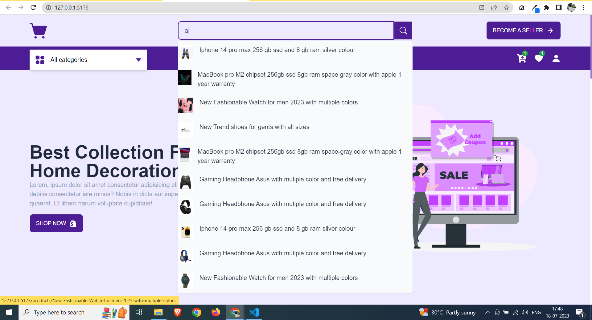

# MERN Stack Ecommerce Project

Welcome to the MERN Stack Ecommerce Project! This ongoing project utilizes the MERN stack (MongoDB, Express.js, React, and Node.js) to create a full-fledged ecommerce application with various features. The project includes a login/signup page, homepage, products page, FAQ page, events page, search functionality, category-based product filtering, a best deals section, and more.

## SIGNUP & LOGIN PAGE

  
  

## HOME PAGE

  
  

## SEARCH & FILTER BY CATEGORY FEATURES

  
  

## PRODUCTS PAGE & EVENTS PAGE

  
  

## FAQ PAGE & BEST DEALS SECTION

  
  

## Technologies Used

-   **Frontend:**

    -   React
    -   Tailwind CSS
    -   Daisy UI (as a component library)
    -   Axios (for data fetching)
    -   Axios interceptors (for handling requests)
    -   React Icons (for icons)
    -   Framer Motion (for animations)
    -   React Router (for routing)
    -   Formik and Yup (for form handling and validation)
    -   Redux Toolkit (for state management)

-   **Backend:**
    -   Node.js
    -   Express.js
    -   MongoDB

## Project Structure

The project structure follows a standard MERN stack architecture. Here's an overview of the main components and directories:

## Features

-   Login/Signup Page:

-   Users can create a new account or login with existing credentials.

## Homepage:

-   Displays featured products, promotions, and best deals.
-   Provides navigation to different sections of the website.
-   Products Page:

-   Lists all products available for purchase.
-   Allows users to filter products by category.
-   Provides search functionality to find specific products.

## FAQ Page:

-   Displays frequently asked questions and their answers.

## Events Page:

-   Showcases upcoming events, sales, or promotions.

## Best Deals Section:

-   Highlights the best deals and discounts available on products.

##### Please note that this readme file is a general overview of the project. As the project is ongoing and incomplete, the specific implementation details and additional features may vary based on your ongoing development efforts.
